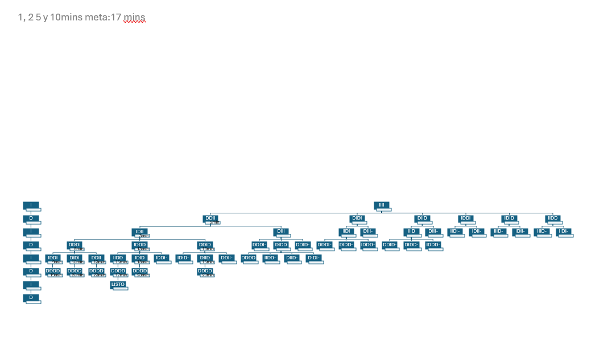
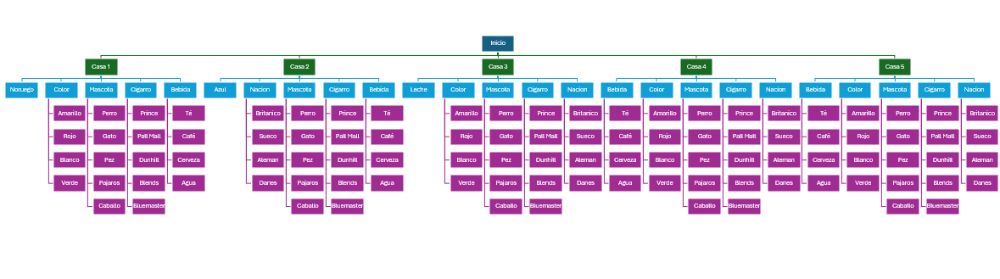

# Índice General de Actividades

1.  **Python**
    * [Manejo de preorden y cadenas](#090125-manejo-de-preorden-y-cadenas)
        * [Conversión a Preorden](#1-conversión-a-preorden)
        * [Validación de Cadenas de Paréntesis](#2-validación-de-cadenas-de-paréntesis)
        * [Creación de particiones de números enteros](#3-creacion-de-particiones-de-numeros-enteros)

2.  **Lisp**
    * [Funciones división y multiplicación](#090325-funciones-division-y-multiplicación)
        * [División](#1-division)
        * [Multiplicación](#2-multiplicación)
    * [Acertijos](#091825-acertijos)
        * [Acertijo del Puente](#1-puente)
        * [Acertijo de las Casas](#2-casas)
    * [Definición de árbol genealógico](#092225-definicion-de-árbol-genealogico-en-lisp)
    * [Ejercicios con car y cdr](#092625-ejercicios-de-lisp---problemas-con-car-y-cdr)
    * [Funciones de Área y Volumen](#092925-funciones-de-área-y-volumen-en-lisp)

3.  **Lógica y Prolog**
    * [Lógica de Primer Orden](#100125-logica-primer-orden)
    * [Propiedades y Predicados](#021025-propiedades)
    * [Árbol Genealógico en Prolog](#100825-arbol)
    * [Ejercicios de Listas en Prolog](#102225-ejercicios-prolog)

---

#  09/01/25 Manejo de preorden y cadenas

## 1\. Conversión a Preorden 

### Explicación del Algoritmo

```python
def infija_a_prefija(expresion):

    
    precedencia = {'+': 1, '-': 1, '*': 2, '/': 2}
    pila = []
    salida = []
    
    
    expresion_invertida = expresion.replace('(', '_').replace(')', '(').replace('_', ')')
    expresion_invertida = expresion_invertida[::-1]
    
    
    import re
    tokens = re.findall(r"(\b\w+\b|\S)", expresion_invertida)

    for token in tokens:
        
        if token.isnumeric():
            salida.append(token)
        elif token == '(':
            pila.append(token)
        elif token == ')':
            while pila and pila[-1] != '(':
                salida.append(pila.pop())
            pila.pop()
        else:
            while (pila and pila[-1] != '(' and 
                   precedencia.get(token, 0) <= precedencia.get(pila[-1], 0)):
                salida.append(pila.pop())
            pila.append(token)

    while pila:
        salida.append(pila.pop())

    return " ".join(salida[::-1])

# --- Casos de prueba ---
casos_infija = [
    "6+4*7+5+6+3+2+3",
    "6+12+9+8*3*6*3+2",
    "6/2*5+6*3+9+8+9"
]

print("--- Conversión a Notación Prefija ---")
for caso in casos_infija:
    resultado = infija_a_prefija(caso)
    print(f"Infija:  {caso}")
    print(f"Prefija: {resultado}\n")

```

### Resultados de los Casos de Prueba

```
--- Conversión a Notación Prefija ---
Infija:  6+4*7+5+6+3+2+3
Prefija: + + + + + + 6 * 4 7 5 6 3 2 3

Infija:  6+12+9+8*3*6*3+2
Prefija: + + + + 6 12 9 * * * 8 3 6 3 2

Infija:  6/2*5+6*3+9+8+9
Prefija: + + + + * * / 6 2 5 * 6 3 9 8 9
```

-----

## 2. Validación de Cadenas de Paréntesis 


```python
def validar_parentesis(cadena):
    """
    Valida si una cadena de paréntesis está bien formada usando una pila.
    """
    pila = []
    for char in cadena:
        if char == '(':
            # Si es de apertura, se mete a la pila
            pila.append(char)
        elif char == ')':
            # Si es de cierre, intentar sacar de la pila
            if not pila:
                # Si la pila está vacía, no hay con qué emparejar
                return False
            pila.pop()
    
    # La cadena es válida solo si la pila termina vacía
    return not pila

# --- Casos de prueba ---
casos_parentesis = [
    "(()))(()",   # Inválida
    "(())()())",  # Inválida
    "()())(())",  # Inválida
    "((()))()()"  # Válida
]

print("\n--- Validación de Paréntesis ---")
for caso in casos_parentesis:
    es_valido = validar_parentesis(caso)
    print(f"Cadena: {caso} -> {'Válida' if es_valido else 'Inválida'}")

```

### Resultados de los Casos de Prueba

```
--- Validación de Paréntesis ---
Cadena: (()))(() -> Inválida
Cadena: (())()()) -> Inválida
Cadena: ()())(()) -> Inválida
Cadena: ((()))()() -> Válida
```
## 3. Creacion de particiones de numeros enteros
```python

import flet as ft

def main(page):
    
    page.scroll = "auto"
    page.title = "Particiones de un número"
    
    n = ft.TextField(label="Número a particionar" )
    maximo = n - 1
    page.add(n)
    
    page.add(ft.ElevatedButton("Calcular particiones", on_click=lambda e: particiones(int(n.value), maximo)))
    
    def particiones(n, maximo):
        
        if n == 0:
            # caso base: devolvemos una lista vacía que representa una partición
            yield []
        else:
            for k in range(min(n, maximo), 0, -1):
                for resto in particiones(n - k, k):
                    yield []

    for p in particiones(n, maximo):
        page.add(ft.TextField(p))

ft.app(main)
```
# 09/03/25 Funciones division y multiplicación

## 1. Division
```python
(defun division (a b)
  "Calcula el cociente y el residuo de a/b usando restas recursivas."
  (if (< a b)
      ; 
      (list 0 a)
      ; 
      (let ((res (division (- a b) b)))
        ; 
        (list (+ 1 (first res)) (second res)))))
``` 

## 2. Multiplicación
```python
(defun mult (a b)
  "Calcula a * b usando sumas recursivas."
  (if (= b 0)
      ; 
      0
      ; Caso recursivo: suma a + (a * (b-1)).
      (+ a (mult a (- b 1)))))
```
# 09/18/25 Acertijos

## 1. Puente
### Cuatro personas necesitan cruzar un puente de noche con un sola linterna. El puente es frágil y solo puede soportar a dos personas a la vez. Cada persona tarda diferentes tiempos en cruzar (1, 2 5 y 10 minutos).  Cuando dos personas cruzan, lo hacen al ritmo del más lento ¿Cómo pueden todos cruzar el puente en 17 minutos?


## 2. Casas
### En una calle hay cinco casas, cada una de un color distinto.  En cada casa vive una persona de distinta nacionalidad.  Cada dueño bebe un único tipo de bebida, fuma una sola marca de cigarrillos y tiene una mascota diferente a sus vecinos.  A partir de las 15 pistas presentadas a continuación, la consigna que hay que responder es: "¿Quién es el dueño del pez?".

El británico vive en la casa roja. <br>
El sueco tiene un perro como mascota.<br>
El danés toma té.<br>
El noruego vive en la primera casa.<br>
El alemán fuma Prince.<br>
La casa verde está inmediatamente a la izquierda de la blanca.<br>
El dueño de la casa verde bebe café.<br>
El propietario que fuma Pall Mall cría pájaros.<br>
El dueño de la casa amarilla fuma Dunhill.<br>
El hombre que vive en la casa del centro bebe leche.<br>
El vecino que fuma Blends vive al lado del que tiene un gato.<br>
El hombre que tiene un caballo vive al lado del que fuma Dunhill.<br>
El propietario que fuma Bluemaster toma cerveza.<br>
El vecino que fuma Blends viveal lado del que toma agua.<br>
El noruego vive al lado de la casa azul. <br>


# 09/22/25 Definicion de árbol genealogico en Lisp

```lisp

(defparameter *Arbol-familiar* 
  '((abuelos
     (masculino 
      (nombre "Luis Martinez")
      (nacimiento 1940)
      (profesion "Carpintero"))
     (femenino 
      (nombre "Maria Gonzalez") 
      (nacimiento 1943)
      (profesion "Maestra")))
    
    (padres
     (masculino
      (nombre "Carlos Martinez")
      (nacimiento 1965)
      (profesion "Ingeniero")
      (padre "Luis Martinez")
      (madre "Maria Gonzalez"))
     (femenino
      (nombre "Ana Lopez")
      (nacimiento 1968) 
      (profesion "Doctora")
      (padre "Pedro Lopez")
      (madre "Carmen Ruiz")))
    
    (hijos
     (masculino
      (nombre "Diego Martinez Lopez")
      (nacimiento 1995)
      (profesion "Estudiante")
      (padre "Carlos Martinez")
      (madre "Ana Lopez"))
     (femenino
      (nombre "Sofia Martinez Lopez")
      (nacimiento 1998)
      (profesion "Estudiante")
      (padre "Carlos Martinez") 
      (madre "Ana Lopez"))
     (masculino
      (nombre "Mateo Martinez Lopez")
      (nacimiento 2001)
      (profesion "Estudiante")
      (padre "Carlos Martinez")
      (madre "Ana Lopez")))))
```

# 09/26/25 Ejercicios de Lisp - Problemas con car y cdr

## Soluciones a los ejercicios

### 1. Lista: (a b c d e) → Extraer d
```lisp
(car (cdr (cdr (cdr '(a b c d e)))))
; o alternativamente:
(cadddr '(a b c d e))
```

### 2. Lista: ((1 2) (3 4) (5 6)) → Extraer 5
```lisp
(car (car (cdr (cdr '((1 2) (3 4) (5 6))))))
; o alternativamente:
(caar (cddr '((1 2) (3 4) (5 6))))
```

### 3. Lista: ((a b) (c d) (e f)) → Extraer e
```lisp
(car (car (cdr (cdr '((a b) (c d) (e f))))))
; o alternativamente:
(caar (cddr '((a b) (c d) (e f))))
```

### 4. Lista: ((x y) ((p q) (r s)) (z w)) → Extraer z
```lisp
(car (car (cdr (cdr '((x y) ((p q) (r s)) (z w))))))
; o alternativamente:
(caar (cddr '((x y) ((p q) (r s)) (z w))))
```

### 5. Lista: ((1 (2 3)) (4 (5 6))) → Extraer 6
```lisp
(car (cdr (car (cdr (car (cdr '((1 (2 3)) (4 (5 6)))))))))
; o alternativamente:
(cadr (cadr (cadr '((1 (2 3)) (4 (5 6))))))
```

### 6. Lista: (((a b) c) d e) → Extraer c
```lisp
(car (cdr (car '(((a b) c) d e))))
; o alternativamente:
(cadar '(((a b) c) d e))
```

### 7. Lista: ((1 2) 3) ((4 5) 6)) → Extraer 6
```lisp
(car (cdr (car (cdr '(((1 2) 3) ((4 5) 6))))))
; o alternativamente:
(cadar (cdr '(((1 2) 3) ((4 5) 6))))
```

### 8. Lista: ((p (q (r s))) t u) → Extraer (r s)
```lisp
(car (cdr (car (cdr (car '((p (q (r s))) t u))))))
; o alternativamente:
(cadar (car '((p (q (r s))) t u)))
```

### 9. Lista: (((a) b) (c (d e)) f) → Extraer d
```lisp
(car (car (cdr (car (cdr '(((a) b) (c (d e)) f))))))
; o alternativamente:
(caar (cdr (cadr '(((a) b) (c (d e)) f))))
```

### 10. Lista: ((1 (2 (3 4))) (5 6)) → Extraer 3
```lisp
(car (car (cdr (car (cdr (car '((1 (2 (3 4))) (5 6))))))))
; o alternativamente:
(caar (cdr (cadr (car '((1 (2 (3 4))) (5 6))))))
```

### 11. Lista: (((x) (y)) ((z) (w))) → Extraer (w)
```lisp
(car (cdr (car (cdr '(((x) (y)) ((z) (w)))))))
; o alternativamente:
(cadr (cadr '(((x) (y)) ((z) (w)))))
```

### 12. Lista: ((a (b (c d))) (e f)) → Extraer c
```lisp
(car (car (cdr (car (cdr (car '((a (b (c d))) (e f))))))))
; o alternativamente:
(caar (cdr (cadr (car '((a (b (c d))) (e f))))))
```

### 13. Lista: ((1 (2 (3 (4 5)))) (6 7)) → Extraer 4
```lisp
(car (car (cdr (car (cdr (car (cdr (car '((1 (2 (3 (4 5)))) (6 7))))))))))
; o alternativamente:
(caar (cdr (car (cdr (cadr (car '((1 (2 (3 (4 5)))) (6 7))))))))
```

### 14. Lista: (((a b) c) ((d e) f) ((g h) i)) → Extraer g
```lisp
(car (car (car (cdr (cdr '(((a b) c) ((d e) f) ((g h) i)))))))
; o alternativamente:
(caar (caddr '(((a b) c) ((d e) f) ((g h) i))))
```

### 15. Lista: ((x y) (z w)) ((p q) (r s))) → Extraer r
```lisp
(car (car (cdr (car (cdr '(((x y) (z w)) ((p q) (r s))))))))
; o alternativamente:
(caar (cdr (cadr '(((x y) (z w)) ((p q) (r s))))))
```

### 16. Lista: (((1 (2 (3 (4 (5 6))))) (7 8)) → Extraer 5
```lisp
(car (car (cdr (car (cdr (car (cdr (car (cdr (car '((1 (2 (3 (4 (5 6))))) (7 8))))))))))))
; o alternativamente:
(caar (cdr (car (cdr (car (cdr (cadr (car '((1 (2 (3 (4 (5 6))))) (7 8)))))))))
```

### 17. Lista: (((a (b (c (d e)))) (f g)) → Extraer d
```lisp
(car (car (cdr (car (cdr (car (cdr (car '(((a (b (c (d e)))) (f g))))))))))
; o alternativamente:
(caar (cdr (car (cdr (cadr (car '(((a (b (c (d e)))) (f g))))))))
```

### 18. Lista: (((1 2) (3 4)) ((5 6) (7 8))) → Extraer 7
```lisp
(car (car (cdr (car (cdr '(((1 2) (3 4)) ((5 6) (7 8))))))))
; o alternativamente:
(caar (cdr (cadr '(((1 2) (3 4)) ((5 6) (7 8))))))
```

### 19. Lista: ((x (y (z (w v))))) → Extraer w
```lisp
(car (car (cdr (car (cdr (car (cdr (car '((x (y (z (w v))))))))))))
; o alternativamente:
(caar (cdr (car (cdr (cadr (car '((x (y (z (w v))))))))))
```

### 20. Lista: (((a b c) (d e f)) ((g h i) (j k l))) → Extraer j
```lisp
(car (car (cdr (car (cdr '(((a b c) (d e f)) ((g h i) (j k l))))))))
; o alternativamente:
(caar (cdr (cadr '(((a b c) (d e f)) ((g h i) (j k l))))))
```

# 09/29/25 Funciones de Área y Volumen en Lisp

## FUNCIONES PARA CALCULAR ÁREAS

### 1. Área de un Círculo
```lisp
(defun area-circulo (radio)
  (let ((resultado (* pi radio radio)))
    (princ "Área del círculo: ")
    (princ resultado)
    (terpri)
    resultado))
```

### 2. Área de un Triángulo
```lisp
(defun area-triangulo (base altura)
  (let ((resultado (/ (* base altura) 2)))
    (princ "Área del triángulo: ")
    (princ resultado)
    (terpri)
    resultado))
```

### 3. Área de un Trapecio
```lisp
(defun area-trapecio (base-mayor base-menor altura)
  (let ((resultado (/ (* (+ base-mayor base-menor) altura) 2)))
    (princ "Área del trapecio: ")
    (princ resultado)
    (terpri)
    resultado))
```

### 4. Área de un Rombo
```lisp
(defun area-rombo (diagonal-mayor diagonal-menor)
  (let ((resultado (/ (* diagonal-mayor diagonal-menor) 2)))
    (princ "Área del rombo: ")
    (princ resultado)
    (terpri)
    resultado))
```

### 5. Área de un Pentágono Regular
```lisp
(defun area-pentagono (lado apotema)
  (let ((resultado (/ (* 5 lado apotema) 2)))
    (princ "Área del pentágono: ")
    (princ resultado)
    (terpri)
    resultado))
```

### 6. Área de un Hexágono Regular
```lisp
(defun area-hexagono (lado)
  (let ((resultado (* (/ (* 3 (sqrt 3)) 2) lado lado)))
    (princ "Área del hexágono: ")
    (princ resultado)
    (terpri)
    resultado))
```

### 7. Área de una Elipse
```lisp
(defun area-elipse (semieje-mayor semieje-menor)
  (let ((resultado (* pi semieje-mayor semieje-menor)))
    (princ "Área de la elipse: ")
    (princ resultado)
    (terpri)
    resultado))
```

### 8. Área de un Sector Circular
```lisp
(defun area-sector-circular (radio angulo-grados)
  (let ((resultado (* pi radio radio (/ angulo-grados 360))))
    (princ "Área del sector circular: ")
    (princ resultado)
    (terpri)
    resultado))
```

### 9. Área de un Paralelogramo
```lisp
(defun area-paralelogramo (base altura)
  (let ((resultado (* base altura)))
    (princ "Área del paralelogramo: ")
    (princ resultado)
    (terpri)
    resultado))
```

### 10. Área de un Octágono Regular
```lisp
(defun area-octagono (lado)
  (let ((resultado (* 2 (+ 1 (sqrt 2)) lado lado)))
    (princ "Área del octágono: ")
    (princ resultado)
    (terpri)
    resultado))
```

---

## FUNCIONES PARA CALCULAR VOLÚMENES

### 1. Volumen de una Esfera
```lisp
(defun volumen-esfera (radio)
  (let ((resultado (* (/ 4 3) pi radio radio radio)))
    (princ "Volumen de la esfera: ")
    (princ resultado)
    (terpri)
    resultado))
```

### 2. Volumen de un Cubo
```lisp
(defun volumen-cubo (lado)
  (let ((resultado (* lado lado lado)))
    (princ "Volumen del cubo: ")
    (princ resultado)
    (terpri)
    resultado))
```

### 3. Volumen de un Cilindro
```lisp
(defun volumen-cilindro (radio altura)
  (let ((resultado (* pi radio radio altura)))
    (princ "Volumen del cilindro: ")
    (princ resultado)
    (terpri)
    resultado))
```

### 4. Volumen de un Cono
```lisp
(defun volumen-cono (radio altura)
  (let ((resultado (* (/ 1 3) pi radio radio altura)))
    (princ "Volumen del cono: ")
    (princ resultado)
    (terpri)
    resultado))
```

### 5. Volumen de una Pirámide
```lisp
(defun volumen-piramide (area-base altura)
  (let ((resultado (/ (* area-base altura) 3)))
    (princ "Volumen de la pirámide: ")
    (princ resultado)
    (terpri)
    resultado))
```

### 6. Volumen de un Prisma Rectangular
```lisp
(defun volumen-prisma-rectangular (largo ancho altura)
  (let ((resultado (* largo ancho altura)))
    (princ "Volumen del prisma rectangular: ")
    (princ resultado)
    (terpri)
    resultado))
```

### 7. Volumen de un Tetraedro Regular
```lisp
(defun volumen-tetraedro (arista)
  (let ((resultado (/ (* arista arista arista) (* 6 (sqrt 2)))))
    (princ "Volumen del tetraedro: ")
    (princ resultado)
    (terpri)
    resultado))
```

### 8. Volumen de un Elipsoide
```lisp
(defun volumen-elipsoide (a b c)
  (let ((resultado (* (/ 4 3) pi a b c)))
    (princ "Volumen del elipsoide: ")
    (princ resultado)
    (terpri)
    resultado))
```

### 9. Volumen de un Toro
```lisp
(defun volumen-toro (radio-mayor radio-menor)
  (let ((resultado (* 2 pi pi radio-mayor radio-menor radio-menor)))
    (princ "Volumen del toro: ")
    (princ resultado)
    (terpri)
    resultado))
```

### 10. Volumen de una Pirámide Truncada
```lisp
(defun volumen-piramide-truncada (area-base-mayor area-base-menor altura)
  (let ((resultado (* (/ altura 3) 
                      (+ area-base-mayor 
                         area-base-menor 
                         (sqrt (* area-base-mayor area-base-menor))))))
    (princ "Volumen de la pirámide truncada: ")
    (princ resultado)
    (terpri)
    resultado))
```

---

## EJEMPLOS DE USO

```lisp
;; Ejemplos de áreas:
(area-circulo 5)              
;; Salida: "Área del círculo: 78.53981633974483"

(area-triangulo 6 4)          
;; Salida: "Área del triángulo: 12"

(area-trapecio 8 5 4)         
;; Salida: "Área del trapecio: 26"

;; Ejemplos de volúmenes:
(volumen-esfera 3)            
;; Salida: "Volumen de la esfera: 113.09733552923255"

(volumen-cubo 5)              
;; Salida: "Volumen del cubo: 125"

(volumen-cilindro 2 10)       
;; Salida: "Volumen del cilindro: 125.66370614359172"
```

# 10/01/25 Logica Primer Orden
;;; DOMINIO DEL DISCURSO
;;; Objetos: tierra, luna, sol, planetas, satélites, perros, carteros

;;; CONSTANTES DE INDIVIDUO
;;; tierra - La Tierra
;;; luna - La Luna
;;; sol - El Sol

;;; PREDICADOS (PROPIEDADES)
;;; (Planeta x) - x es un planeta
;;; (Satelite x) - x es un satélite
;;; (Perro x) - x es un perro
;;; (Cartero x) - x es un cartero

;;; PREDICADOS (RELACIONES)
;;; (Gira-alrededor x y) - x gira alrededor de y
;;; (Muerde x y) - x muerde a y
;;; (Asusta x y) - x asusta a y

;;; ============================================
;;; TRADUCCIÓN DE LOS ENUNCIADOS
;;; ============================================

;; 1. La Tierra es un planeta.
(Planeta tierra)

;; 2. La Luna no es un planeta.
(not (Planeta luna))

;; 3. La Luna es un satélite.
(Satelite luna)

;; 4. La Tierra gira alrededor del Sol.
(Gira-alrededor tierra sol)

;; 5. Todo planeta es un satélite.
;; ∀x (Planeta(x) → Satélite(x))
(forall (x)
  (implies (Planeta x)
           (Satelite x)))

;; 6. Todo planeta gira alrededor del Sol.
;; ∀x (Planeta(x) → Gira-alrededor(x, sol))
(forall (x)
  (implies (Planeta x)
           (Gira-alrededor x sol)))

;; 7. Algún planeta gira alrededor de la Luna.
;; ∃x (Planeta(x) ∧ Gira-alrededor(x, luna))
(exists (x)
  (and (Planeta x)
       (Gira-alrededor x luna)))

;; 8. Hay por lo menos un satélite.
;; ∃x (Satélite(x))
(exists (x)
  (Satelite x))

;; 9. Todos los perros del vecindario muerden a algún cartero.
;; ∀x (Perro(x) → ∃y (Cartero(y) ∧ Muerde(x, y)))
(forall (x)
  (implies (Perro x)
           (exists (y)
             (and (Cartero y)
                  (Muerde x y)))))

;; 10. Hay un cartero al que lo muerden todos los perros.
;; ∃y (Cartero(y) ∧ ∀x (Perro(x) → Muerde(x, y)))
(exists (y)
  (and (Cartero y)
       (forall (x)
         (implies (Perro x)
                  (Muerde x y)))))

;; 11. Todos los carteros son mordidos por algún perro.
;; ∀y (Cartero(y) → ∃x (Perro(x) ∧ Muerde(x, y)))
(forall (y)
  (implies (Cartero y)
           (exists (x)
             (and (Perro x)
                  (Muerde x y)))))

;; 12. Hay un perro que muerde a todos los carteros.
;; ∃x (Perro(x) ∧ ∀y (Cartero(y) → Muerde(x, y)))
(exists (x)
  (and (Perro x)
       (forall (y)
         (implies (Cartero y)
                  (Muerde x y)))))

;; 13. Todos los perros que asustan a algún cartero, lo muerden.
;; ∀x ∀y ((Perro(x) ∧ Cartero(y) ∧ Asusta(x, y)) → Muerde(x, y))
(forall (x)
  (forall (y)
    (implies (and (Perro x)
                  (Cartero y)
                  (Asusta x y))
             (Muerde x y))))

;; 14. Hay un perro que muerde a todos los perros que muerden a algún cartero.
;; ∃x (Perro(x) ∧ ∀z ((Perro(z) ∧ ∃y (Cartero(y) ∧ Muerde(z, y))) → Muerde(x, z)))
(exists (x)
  (and (Perro x)
       (forall (z)
         (implies (and (Perro z)
                       (exists (y)
                         (and (Cartero y)
                              (Muerde z y))))
                  (Muerde x z)))))

;; 15. Hay un solo perro que se muerde a sí mismo.
;; ∃x (Perro(x) ∧ Muerde(x, x) ∧ ∀y ((Perro(y) ∧ Muerde(y, y)) → (= y x)))
(exists (x)
  (and (Perro x)
       (Muerde x x)
       (forall (y)
         (implies (and (Perro y)
                       (Muerde y y))
                  (= y x)))))

;;; ============================================
;;; RESUMEN DE ELEMENTOS
;;; ============================================

;;; VARIABLES DE INDIVIDUO: x, y, z
;;; CONSTANTES DE INDIVIDUO: tierra, luna, sol
;;; CUANTIFICADORES: forall (∀), exists (∃)
;;; PROPIEDADES: Planeta, Satelite, Perro, Cartero
;;; RELACIONES: Gira-alrededor, Muerde, Asusta
;;; DOMINIO: {planetas, satélites, perros, carteros, objetos celestes}

# 02/10/25 Propiedades
-La tierra es un planeta. 
planeta(tierra) -> p(t) predicado : monario
Tierra --> constante de individuo
planeta --> propiedad

-La luna ni es un planeta. 
¬planeta(luna) se esta negando -> predicado : monario
¬p(l)
Luna --> constante de individuo
planeta --> propiedad

-La luna es un satelite.
Luna --> constante de individuo
satelite --> propiedad
predicado : monario
satelit(luna) -> s(l)

-La tierra gira alrededor del sol
tierra --> constante de individuo
sol --> constante de individuo
gira alrededor --> propiedad
gira_alrededor(tierra, sol) -> ga(t, s)
predicado : binario

-Todo planeta es un satelite
∀ -> cuantificador universal
planeta -> propiedad

//predicarios binario terinario

sol -> constante de individuo 
AxP(x) -> (x,sol)

-Algun planeta gira al rededor de la luna.
E -> cuantificador existencial 
plantea ->propiedad, vairable de individiuo 
gira alrededor -> propiedad
Luna -> constante de individuo
reflas de inferencia
ExPlaneta(x)´g(X,Luna), ExP(x)'g(X, L)

Hay por lo menos un satelite 
E -> cuantificador existentencial
satelite -> propiedad, variable de individuo
predicado -> monario 
ExS(x)


predicarios monarios y binarios

padre(pancho).

pradrede(jose, juan).


Todos los perros del vecinadrio muerden a algun cartero

A -> cuantificador universal
perros del vecinario -> propiedad, variabl de invididuo
muerde -> propiedad
E -> cuantificador existencial
cartero -> propiedad, variable de individuo
AxPerro(x) ->EyCartero(Y) EyMuerde(X,Y)

# 10/08/25 Arbol
% Hechos básicos - Padres
padre(julio).
padre(ramiro).
padre(carlos).
padre(roberto).
padre(diego).

% Hechos básicos - Madres
madre(ana).
madre(lucia).
madre(carmen).
madre(sofia).
madre(elena).

% Hechos básicos - Hombres
hombre(julio).
hombre(ramiro).
hombre(juan).
hombre(jose).
hombre(luis).
hombre(antonio).
hombre(carlos).
hombre(roberto).
hombre(diego).
hombre(miguel).
hombre(pedro).

% Hechos básicos - Mujeres
mujer(maria).
mujer(antonia).
mujer(ana).
mujer(lucia).
mujer(carmen).
mujer(sofia).
mujer(elena).
mujer(rosa).
mujer(laura).
mujer(patricia).

% Relaciones padre/madre de
padrede(jose, juan).
padrede(juan, jose).
padrede(juan, luis).
padrede(juan, maria).
padrede(juan, antonia).
padrede(jose, antonio).
padrede(carlos, miguel).
padrede(carlos, rosa).
padrede(roberto, pedro).
padrede(roberto, laura).
padrede(diego, patricia).

% Relaciones madre de
madrede(maria, juan).
madrede(ana, jose).
madrede(ana, luis).
madrede(lucia, maria).
madrede(lucia, antonia).
madrede(carmen, antonio).
madrede(sofia, miguel).
madrede(sofia, rosa).
madrede(elena, pedro).
madrede(elena, laura).
madrede(antonia, patricia).

% Regla: X es padre de Y si X es padre y es padre de Y
padre(X, Y) :- hombre(X), padrede(X, Y).

% Regla: X es madre de Y si X es mujer y es madre de Y
madre(X, Y) :- mujer(X), madrede(X, Y).

% Regla: X es hijo de Y
hijo(X, Y) :- hombre(X), (padrede(Y, X); madrede(Y, X)).

% Regla: X es hija de Y
hija(X, Y) :- mujer(X), (padrede(Y, X); madrede(Y, X)).

% Regla: X es abuelo de Y
abuelo(X, Y) :- hombre(X), padrede(X, Z), (padrede(Z, Y); madrede(Z, Y)).

% Regla: X es abuela de Y
abuela(X, Y) :- mujer(X), madrede(X, Z), (padrede(Z, Y); madrede(Z, Y)).

% Regla: X e Y son hermanos (mismo padre o misma madre, y ambos son hombres)
hermanos(X, Y) :- 
    hombre(X), 
    hombre(Y), 
    X \= Y,
    (
        (padrede(Z, X), padrede(Z, Y));
        (madrede(Z, X), madrede(Z, Y))
    ).

% Regla: X e Y son hermanas (mismo padre o misma madre, y ambas son mujeres)
hermanas(X, Y) :- 
    mujer(X), 
    mujer(Y), 
    X \= Y,
    (
        (padrede(Z, X), padrede(Z, Y));
        (madrede(Z, X), madrede(Z, Y))
    ).

% Regla: X e Y son hermano y hermana (independiente del género)
hermano_hermana(X, Y) :- 
    X \= Y,
    (
        (padrede(Z, X), padrede(Z, Y));
        (madrede(Z, X), madrede(Z, Y))
    ).

% Regla: X es tío de Y (hermano del padre o madre de Y)
tio(X, Y) :- 
    hombre(X),
    (padrede(Z, Y); madrede(Z, Y)),
    hermano_hermana(X, Z).

% Regla: X es tía de Y (hermana del padre o madre de Y)
tia(X, Y) :- 
    mujer(X),
    (padrede(Z, Y); madrede(Z, Y)),
    hermano_hermana(X, Z).

% Regla: X e Y son primos (sus padres son hermanos)
primos(X, Y) :- 
    X \= Y,
    (padrede(P1, X); madrede(P1, X)),
    (padrede(P2, Y); madrede(P2, Y)),
    P1 \= P2,
    hermano_hermana(P1, P2).

% Ejemplos de consultas:
% ?- hermanos(jose, luis).
% ?- hermanas(maria, antonia).
% ?- hermano_hermana(jose, maria).
% ?- primos(juan, antonio).
% ?- tio(jose, maria).
% ?- tia(antonia, patricia).
% ?- abuelo(juan, patricia).
% ?- abuela(maria, juan).

Claro, aquí tienes el texto convertido a formato Markdown.

# 10/22/25 Ejercicios Prolog


## Tabla de contenido

1.  [Práctica: Listas en Prolog](#1-práctica-listas-en-prolog)
2.  [Objetivo](#11-objetivo)
3.  [Instrucciones generales](#12-instrucciones-generales)
4.  [Ejercicio 1: Cabeza y cola de una lista](#13-ejercicio-1-cabeza-y-cola-de-una-lista)
5.  [Ejercicio 2: Verificar si un elemento pertenece a una lista](#14-ejercicio-2-verificar-si-un-elemento-pertenece-a-una-lista)
6.  [Ejercicio 3: Calcular la longitud de una lista](#15-ejercicio-3-calcular-la-longitud-de-una-lista)
7.  [Ejercicio 4: Concatenar dos listas](#16-ejercicio-4-concatenar-dos-listas)
8.  [Ejercicio 5: Invertir una lista](#17-ejercicio-5-invertir-una-lista)
9.  [Ejercicio 6: Obtener el último elemento](#18-ejercicio-6-obtener-el-último-elemento)
10. [Ejercicio 7: Sumar los elementos de una lista numérica](#19-ejercicio-7-sumar-los-elementos-de-una-lista-numérica)
11. [Ejercicio 8: Eliminar un elemento de una lista](#110-ejercicio-8-eliminar-un-elemento-de-una-lista)
12. [Ejercicio 9: Duplicar los elementos de una lista](#111-ejercicio-9-duplicar-los-elementos-de-una-lista)
13. [Ejercicio 10: Intercalar dos listas](#112-ejercicio-10-intercalar-dos-listas)

-----

# 1\. Práctica: Listas en Prolog

## 1.1 Objetivo

Aprender a manipular listas en Prolog mediante ejercicios básicos de definición, acceso, recursión y construcción de predicados.

-----

## 1.2 Instrucciones generales

-----

## 1.3 Ejercicio 1: Cabeza y cola de una lista

Define un predicado que permita obtener la cabeza y la cola de una lista.

**Consulta:**

```prolog
?- cabeza_y_cola([a,b,c,d], C, T).
```

-----

## 1.4 Ejercicio 2: Verificar si un elemento pertenece a una lista

Crea un predicado `pertenece/2` que determine si un elemento se encuentra en una lista.

**Consulta:**

```prolog
?- pertenece(b, [a,b,c]).
```

-----

## 1.5 Ejercicio 3: Calcular la longitud de una lista

Define un predicado `longitud/2` que devuelva la cantidad de elementos de una lista.

**Consulta:**

```prolog
?- longitud([a,b,c,d], N).
```

-----

## 1.6 Ejercicio 4: Concatenar dos listas

Crea el predicado `concatenar/3` que una dos listas.

**Consulta:**

```prolog
?- concatenar([1,2], [3,4], R).
```

-----

## 1.7 Ejercicio 5: Invertir una lista

Escribe un predicado `invertir/2` que invierta el orden de los elementos.

**Consulta:**

```prolog
?- invertir([a,b,c,d], R).
```

-----

## 1.8 Ejercicio 6: Obtener el último elemento

Crea el predicado `ultimo/2` que retorne el último elemento de una lista.

**Consulta:**

```prolog
?- ultimo([a,b,c,d], X).
```

-----

## 1.9 Ejercicio 7: Sumar los elementos de una lista numérica

Define un predicado `suma_lista/2` que calcule la suma de los elementos de una lista de números.

**Consulta:**

```prolog
?- suma_lista([2,4,6,8], S).
```

-----

## 1.10 Ejercicio 8: Eliminar un elemento de una lista

Crea un predicado `eliminar/3` que elimine la primera aparición de un elemento en una lista.

**Consulta:**

```prolog
?- eliminar(c, [a,b,c,d,c], R).
```

-----

## 1.11 Ejercicio 9: Duplicar los elementos de una lista

Escribe un predicado `duplicar/2` que duplique cada elemento de una lista.

**Consulta:**

```prolog
?- duplicar([a,b,c], R).
```

-----

## 1.12 Ejercicio 10: Intercalar dos listas

Crea un predicado `intercalar/3` que mezcle los elementos de dos listas alternándolos.

**Consulta:**

```prolog
?- intercalar([1,3,5], [2,4,6], R).
```
Claro, aquí tienes las soluciones a los 10 ejercicios de Prolog en formato Markdown.

-----

### **1. Cabeza y cola de una lista (`cabeza_y_cola/3`)**

Este predicado utiliza el unificador `|` de Prolog para separar la lista en su primer elemento (cabeza) y el resto de la lista (cola).

**Código:**

```prolog
% El predicado es verdadero si C es la cabeza y T es la cola de la lista [C|T].
cabeza_y_cola([C|T], C, T).
```

**Consulta de ejemplo:**

```prolog
?- cabeza_y_cola([a,b,c,d], C, T).
C = a,
T = [b, c, d].
```

-----

### **2. Verificar si un elemento pertenece a una lista (`pertenece/2`)**

Este es un predicado recursivo clásico en Prolog.

  * **Caso base**: Un elemento `X` pertenece a una lista si es la cabeza de esa lista `[X|_]`.
  * **Caso recursivo**: Si no es la cabeza, `X` pertenece a la lista si pertenece a la `cola` de la misma `[_|Cola]`.

**Código:**

```prolog
% Caso base: El elemento es la cabeza de la lista.
pertenece(X, [X|_]).

% Caso recursivo: El elemento está en la cola de la lista.
pertenece(X, [_|T]) :- pertenece(X, T).
```

**Consulta de ejemplo:**

```prolog
?- pertenece(b, [a,b,c]).
true.
```

-----

### **3. Calcular la longitud de una lista (`longitud/2`)**

Se resuelve usando recursión.

  * **Caso base**: La longitud de una lista vacía `[]` es 0.
  * **Caso recursivo**: La longitud de una lista no vacía es `1` más la longitud de su cola.

**Código:**

```prolog
% Caso base: La longitud de una lista vacía es 0.
longitud([], 0).

% Caso recursivo: La longitud es 1 + la longitud de la cola.
longitud([_|T], N) :-
    longitud(T, N1), % Calcula la longitud de la cola
    N is N1 + 1.     % Suma 1 al resultado
```

**Consulta de ejemplo:**

```prolog
?- longitud([a,b,c,d], N).
N = 4.
```

-----

### **4. Concatenar dos listas (`concatenar/3`)**

  * **Caso base**: Concatenar una lista vacía `[]` con una lista `L` da como resultado `L`.
  * **Caso recursivo**: Para concatenar `[H|T1]` con `L2`, el resultado será una lista con cabeza `H` y cuya cola es el resultado de concatenar `T1` con `L2`.

**Código:**

```prolog
% Caso base: Concatenar [] con L da L.
concatenar([], L, L).

% Caso recursivo:
concatenar([H|T1], L2, [H|R]) :-
    concatenar(T1, L2, R).
```

**Consulta de ejemplo:**

```prolog
?- concatenar([1,2], [3,4], R).
R = [1, 2, 3, 4].
```

-----

### **5. Invertir una lista (`invertir/2`)**

La forma más eficiente es usar un "acumulador". Se recorre la lista original y se van añadiendo los elementos al principio de una lista auxiliar (el acumulador).

**Código:**

```prolog
% Predicado principal que inicia el auxiliar con un acumulador vacío.
invertir(Lista, Invertida) :-
    invertir_aux(Lista, [], Invertida).

% Caso base: Cuando la lista original está vacía, el acumulador tiene el resultado.
invertir_aux([], Acumulador, Acumulador).

% Caso recursivo: Toma la cabeza de la lista y la pone al inicio del acumulador.
invertir_aux([H|T], Acumulador, Invertida) :-
    invertir_aux(T, [H|Acumulador], Invertida).
```

**Consulta de ejemplo:**

```prolog
?- invertir([a,b,c,d], R).
R = [d, c, b, a].
```

-----

### **6. Obtener el último elemento (`ultimo/2`)**

  * **Caso base**: El último elemento de una lista con un solo elemento `[X]` es `X`.
  * **Caso recursivo**: El último elemento de una lista más larga es el último elemento de su cola.

**Código:**

```prolog
% Caso base: La lista solo tiene un elemento.
ultimo([X], X).

% Caso recursivo: Busca el último en la cola de la lista.
ultimo([_|T], X) :-
    ultimo(T, X).
```

**Consulta de ejemplo:**

```prolog
?- ultimo([a,b,c,d], X).
X = d.
```

-----

### **7. Sumar los elementos de una lista numérica (`suma_lista/2`)**

Similar al predicado de longitud.

  * **Caso base**: La suma de una lista vacía es 0.
  * **Caso recursivo**: La suma de la lista es la `cabeza` más la suma de la `cola`.

**Código:**

```prolog
% Caso base: La suma de una lista vacía es 0.
suma_lista([], 0).

% Caso recursivo: La suma es la Cabeza + la suma de la Cola.
suma_lista([H|T], S) :-
    suma_lista(T, S1),
    S is H + S1.
```

**Consulta de ejemplo:**

```prolog
?- suma_lista([2,4,6,8], S).
S = 20.
```

-----

### **8. Eliminar un elemento de una lista (`eliminar/3`)**

Este predicado elimina solo la primera aparición del elemento.

  * **Caso base**: Si la cabeza `X` es el elemento a eliminar, el resultado es la cola `T`.
  * **Caso recursivo**: Si la cabeza `H` no es el elemento, se mantiene `H` en el resultado y se continúa el proceso de eliminación en la cola `T`.

**Código:**

```prolog
% Caso base: La cabeza es el elemento a eliminar.
eliminar(X, [X|T], T).

% Caso recursivo: La cabeza no es el elemento.
eliminar(X, [H|T], [H|R]) :-
    X \= H, % Se asegura que X y H son diferentes
    eliminar(X, T, R).
```

**Consulta de ejemplo:**

```prolog
?- eliminar(c, [a,b,c,d,c], R).
R = [a, b, d, c].
```

-----

### **9. Duplicar los elementos de una lista (`duplicar/2`)**

  * **Caso base**: Duplicar una lista vacía da como resultado otra lista vacía.
  * **Caso recursivo**: Para una lista `[H|T]`, el resultado será `[H, H | Resto]`, donde `Resto` es el resultado de duplicar la cola `T`.

**Código:**

```prolog
% Caso base: duplicar una lista vacía resulta en una lista vacía.
duplicar([], []).

% Caso recursivo:
duplicar([H|T], [H,H|R]) :-
    duplicar(T, R).
```

**Consulta de ejemplo:**

```prolog
?- duplicar([a,b,c], R).
R = [a, a, b, b, c, c].
```

-----

### **10. Intercalar dos listas (`intercalar/3`)**

  * **Casos base**: Si alguna de las listas está vacía, el resultado es la otra lista.
  * **Caso recursivo**: El resultado se construye tomando la cabeza de la primera lista, la cabeza de la segunda y luego llamando recursivamente a `intercalar` con las colas de ambas.

**Código:**

```prolog
% Casos base: una de las listas está vacía.
intercalar([], L, L).
intercalar(L, [], L).

% Caso recursivo:
intercalar([H1|T1], [H2|T2], [H1,H2|R]) :-
    intercalar(T1, T2, R).
```

**Consulta de ejemplo:**

```prolog
?- intercalar([1,3,5], [2,4,6], R).
R = [1, 2, 3, 4, 5, 6].
```

# 10/29/25 Eliza

template([hola, mi, nombre, es, s(), '.'], ['Hola', 0, '¿cómo estás?', '¿en qué puedo ayudarte?'], [1]). template([buenos, dias], ['Buenos días', 0, '¿cómo te sientes hoy?'], [2]). template([hola, yo, soy, s(), '.'], ['Hola', 0, 'yo soy Eliza'], [3]). template([como, estas], ['Estoy bien, gracias por preguntar.', '¿y tú?'], [4]). template([estoy, bien], ['Me alegra saber eso.', '¿Qué te hace sentir bien hoy?'], [5]). template([estoy, triste], ['Lamento oír eso.', '¿Quieres contarme por qué te sientes así?'], [6]). template([me, siento, solo], ['¿Por qué crees que te sientes solo?'], [7]). template([me, gusta, la, musica], ['¡A mí también me gusta la música!', '¿Qué tipo de música te gusta?'], [8]). template([me, gusta, leer], ['Leer es una gran actividad.', '¿Qué libro lees ahora?'], [9]). template([no, tengo, amigos], ['Eso suena difícil.', '¿Te gustaría hacer nuevos amigos?'], [10]). template([tengo, hambre], ['Quizás deberías comer algo.', '¿Qué te gustaría comer?'], [11]). template([estoy, cansado], ['Parece que necesitas descansar.', '¿Dormiste bien anoche?'], [12]). template([odio, mi, trabajo], ['Parece que no estás contento con tu trabajo.', '¿Qué es lo que no te gusta de él?'], [13]). template([tengo, miedo], ['¿A qué le tienes miedo?'], [14]). template([no, se], ['Está bien no saberlo.', 'A veces solo necesitamos pensar un poco.'], [15]). template([quiero, ser, feliz], ['Todos queremos eso.', '¿Qué cosas te hacen feliz?'], [16]). template([me, siento, perdido], ['A veces todos nos sentimos así.', '¿Qué te hace sentir perdido?'], [17]). template([gracias], ['De nada, estoy aquí para escucharte.'], [18]). template([adios], ['Adiós', 0, 'cuídate mucho.'], [19]). template([buenas, noches], ['Buenas noches', 0, 'que descanses.'], [20]).


# 10/30/25

% ---------- Hechos monarios ----------
likes(musica).
likes(rnb).
likes(rap).
likes(jazz).
likes(pop).
likes(pulque).
likes(pizza).
likes(viajar).
likes(programar).
likes(aprender).

% ---------- Templates básicos ----------
template([hola, mi, nombre, es, s(_), '.'], ['Hola', 0, '¿cómo estás?', '¿en qué puedo ayudarte?'], [1]).
template([buenos, dias], ['Buenos días', 0, '¿cómo te sientes hoy?'], [2]).
template([hola, yo, soy, s(_), '.'], ['Hola', 0, 'yo soy Eliza.'], [3]).
template([como, estas], ['Estoy bien, gracias por preguntar.', '¿y tú?'], [4]).
template([estoy, bien], ['Qué bueno saberlo.', '¿Qué te hace sentir bien hoy?'], [5]).
template([estoy, triste], ['Lamento oír eso.', '¿Quieres contarme por qué te sientes así?'], [6]).
template([me, siento, solo], ['¿Por qué crees que te sientes solo?'], [7]).
template([no, tengo, amigos], ['Eso suena difícil.', '¿Te gustaría hacer nuevos amigos?'], [8]).
template([estoy, cansado], ['Parece que necesitas descansar.', '¿Dormiste bien anoche?'], [9]).
template([adios], ['Adiós', 0, 'cuídate mucho.'], [10]).

% ---------- Preguntas sobre gustos ----------
template([te, gusta, s(X), '?'], ['Sí, me gusta', X, 'también.'], [11]) :-
    likes(X).

template([te, gusta, s(X), '?'], ['No estoy segura si me gusta', X, ', pero suena interesante.'], [12]).

template([que, te, gusta], ['Me gusta', X, '.'], [13]) :-
    random_like(X).

template([cual, es, tu, musica, favorita], ['Me gusta escuchar', X, '.'], [14]) :-
    random_music(X).

template([que, tipo, de, musica, te, gusta], ['Disfruto escuchar', X, '.'], [15]) :-
    random_music(X).

template([te, gusta, comer, s(X), '?'], ['Sí, me encanta comer', X, '.'], [16]) :-
    likes(X).

template([te, gusta, programar, '?'], ['Claro, programar es una de mis cosas favoritas.'], [17]).

template([te, gusta, viajar, '?'], ['Sí, viajar es genial, me gustaría conocer muchos lugares.'], [18]).

template([que, te, gusta, hacer], ['Me gusta', X, '.'], [19]) :-
    random_like(X).

template([gracias], ['De nada, estoy aquí para escucharte.'], [20]).

% ---------- Predicados auxiliares ----------

% Escoge un gusto al azar
random_like(X) :-
    findall(Y, likes(Y), List),
    random_member(X, List).

% Escoge un tipo de música entre los gustos musicales
random_music(X) :-
    member(X, [rock, pop, jazz, clasica]).

% ---------- Motor principal ----------

eliza(Input, Response) :-
    template(Input, Response, _), !.

eliza(_, ['No entiendo lo que dices, pero cuéntame más.']).

% ---------- Bucle interactivo ----------
conversar :-
    write('Tú: '),
    read(Input),
    ( Input == [adios]
      -> write('Eliza: Adiós, cuídate mucho.'), nl
      ;  eliza(Input, Response),
         write('Eliza: '), write(Response), nl,
         conversar
    ).

# 11/24/25 Examen Prolog


% acertijo.pl
% Archivo fuente: /mnt/data/index 1.txt

:- use_module(library(clpfd)).
:- set_prolog_flag(verbose, silent).

solve(Solutions) :-
    Personas = [ana, bruno, carlos, diana, elisa],

    % Dominios (indices para cada atributo)
    Especialidades = [Genetica, Microbiologia, Bioquimica, Inmunologia, Neurociencia],
    Horas        = [H1,H2,H3,H4,H5],    % índices representarán 6,8,10,12,14 (ver map)
    Bebidas      = [Cafe,Te,Jugo,Mate,Agua],
    Equipos      = [Microscopio,Centrifuga,PCR,Espectrometro,Incubadora],
    Paises       = [Mexico,Chile,España,Argentina,Peru],

    % En Prolog usaremos permutaciones de listas concretas para asignar a personas.
    EspecialidadesList = [genetica, microbiologia, bioquimica, inmunologia, neurociencia],
    HorasList = [6,8,10,12,14],
    BebidasList = [cafe, te, jugo, mate, agua],
    EquiposList = [microscopio, centrifuga, pcr, espectrometro, incubadora],
    PaisesList = [mexico, chile, espana, argentina, peru],

    permutation(EspecialidadesList, [E_ana, E_bruno, E_carlos, E_diana, E_elisa]),
    permutation(HorasList,       [T_ana, T_bruno, T_carlos, T_diana, T_elisa]),
    permutation(BebidasList,     [B_ana, B_bruno, B_carlos, B_diana, B_elisa]),
    permutation(EquiposList,     [Q_ana, Q_bruno, Q_carlos, Q_diana, Q_elisa]),
    permutation(PaisesList,      [P_ana, P_bruno, P_carlos, P_diana, P_elisa]),

    % Helpers to refer by person:
    E = [E_ana, E_bruno, E_carlos, E_diana, E_elisa],
    T = [T_ana, T_bruno, T_carlos, T_diana, T_elisa],
    B = [B_ana, B_bruno, B_carlos, B_diana, B_elisa],
    Q = [Q_ana, Q_bruno, Q_carlos, Q_diana, Q_elisa],
    P = [P_ana, P_bruno, P_carlos, P_diana, P_elisa],

    % Traducciones o relaciones directas implementadas como condiciones:

    % 1. El investigador de Genética llega a las 6am.
    nth0(IndexG, E, genetica), nth0(IndexG, T, 6),

    % 2. Ana no trabaja ni en Genética ni en Neurociencia.
    E_ana \= genetica, E_ana \= neurociencia,

    % 3. La persona que usa la Centrífuga bebe Té.
    nth0(Ic, Q, centrifuga), nth0(Ic, B, te),

    % 4. La investigadora de Perú llega a las 10am.
    nth0(Ip, P, peru), nth0(Ip, T, 10),

    % 5. Carlos usa el Espectrómetro.
    Q_carlos = espectrometro,

    % 6. Quien bebe Café llega dos horas antes que quien bebe Jugo.
    nth0(Icafe, B, cafe), nth0(Ijugo, B, jugo),
    nth0(Icafe, T, Tcafe), nth0(Ijugo, T, Tjugo), Tjugo is Tcafe + 2,

    % 7. La persona que trabaja en Inmunología usa PCR.
    nth0(Iinm, E, inmunologia), nth0(Iinm, Q, pcr),

    % 8. La especialista en Bioquímica es de Chile.
    nth0(Ibio, E, bioquimica), nth0(Ibio, P, chile),

    % 9. La Incubadora es utilizada por alguien que llega a las 14pm.
    nth0(Iinc, Q, incubadora), nth0(Iinc, T, 14),

    %10. El investigador de Argentina bebe Mate.
    nth0(Iarg, P, argentina), nth0(Iarg, B, mate),

    %11. Elisa no bebe Té ni Café.
    B_elisa \= te, B_elisa \= cafe,

    %12. Diana trabaja en Microbiología.
    E_diana = microbiologia,

    %13. El que llega a las 8am usa el Microscopio.
    nth0(I8, T, 8), nth0(I8, Q, microscopio),

    %14. Bruno no es de México.
    P_bruno \= mexico,

    %15. La persona de España trabaja en Neurociencia.
    nth0(Iesp, P, espana), nth0(Iesp, E, neurociencia),

    %16. El usuario del equipo PCR llega después que el especialista en Microbiología.
    nth0(Ipcr, Q, pcr), nth0(Imicro, E, microbiologia),
    nth0(Ipcr, T, Tpcr), nth0(Imicro, T, Tmicro), Tpcr > Tmicro,

    %17. El de México usa el equipo que NO es Microscopio ni Incubadora.
    nth0(Imex, P, mexico), nth0(Imex, Q, Qmex), Qmex \= microscopio, Qmex \= incubadora,

    %18. La persona que bebe Agua no usa ni PCR ni Espectrómetro.
    nth0(Iagua, B, agua), nth0(Iagua, Q, Qagua), Qagua \= pcr, Qagua \= espectrometro,

    %19. El especialista en Neurociencia llega después de la persona que bebe Jugo.
    nth0(In, E, neurociencia), nth0(Ij, B, jugo), nth0(In, T, Tn), nth0(Ij, T, Tj), Tn > Tj,

    %20. El de Perú NO bebe Agua.
    nth0(Iperu, P, peru), nth0(Iperu, B, Bperu), Bperu \= agua,

    % Preparar la estructura legible con nombres
    Solutions = solution([
        person(ana, T_ana, E_ana, B_ana, Q_ana, P_ana),
        person(bruno, T_bruno, E_bruno, B_bruno, Q_bruno, P_bruno),
        person(carlos, T_carlos, E_carlos, B_carlos, Q_carlos, P_carlos),
        person(diana, T_diana, E_diana, B_diana, Q_diana, P_diana),
        person(elisa, T_elisa, E_elisa, B_elisa, Q_elisa, P_elisa)
    ]).

% Helper to run and print all solutions
run :-
    findall(S, solve(S), Ss),
    length(Ss, Count),
    format("Se encontraron ~w solución(es).~n~n", [Count]),
    forall(member(Sol, Ss), ( portray_clause(Sol), nl )).